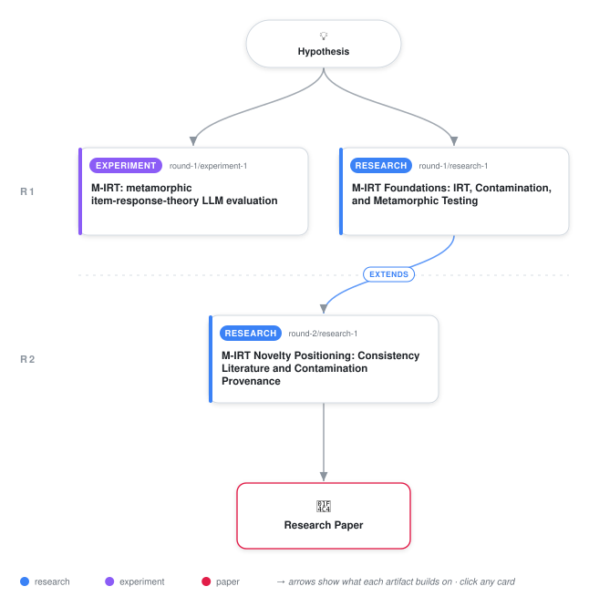

# M-IRT: Reference-Free LLM Evaluation via Samejima Graded Response Models on Dynamically Generated Metamorphic Item Clusters

<div align="center">

<a href="https://cdn.jsdelivr.net/gh/ai-inventor-papers/ai-invention-0afdfa-checking-ai-logic-without-ground-truth@main/workflow.svg">
<picture>
  <source media="(prefers-color-scheme: dark)" srcset="workflow-dark.svg">
  
</picture>
</a>

<sub>🖱️ <b><a href="https://cdn.jsdelivr.net/gh/ai-inventor-papers/ai-invention-0afdfa-checking-ai-logic-without-ground-truth@main/workflow.svg">Open the interactive diagram</a></b> — every card links to its artifact folder.</sub>

</div>

> **TL;DR** — M-IRT is a reference-free LLM evaluation framework that scores an LLM's internal logical coherence across dynamically generated Metamorphic Item Clusters and fits a Samejima Graded Response Model to recover a per-model latent ability theta and per-item discrimination/difficulty. Across five public LLMs and 100 MICs spanning propositional syllogisms and grade-school arithmetic, theta correlates with published MMLU accuracy at Pearson r = 0.975 (Spearman rho = 0.90, Kendall tau = 0.80) and exceeds three binary consistency baselines computed on the same clusters. An artificial stress test on Qwen 2.5 7B confirms that coherence grading penalises internal inconsistency (mean Delta theta = -1.382 across three random seeds). The pipeline is reproducible for under $0.05 in three minutes.

<details>
<summary>Full hypothesis</summary>

Large language model reasoning capability can be estimated without any frozen held-out test set or ground-truth answer key by (i) dynamically generating Metamorphic Item Clusters (MICs) — small families of prompts whose correct answers are bound by a logical relation that does not require computing the seed answer (e.g., a paraphrase, a negation whose oracle is a fixed label derivable from the question text alone, and an inverse/contrapositive whose oracle is a quantity explicitly visible in the seed's question), (ii) measuring each model's logical coherence across each cluster as a polytomous ordinal response, and (iii) fitting a Samejima Graded Response Model (GRM) to recover a per-model latent ability θ whose rank ordering of models is meaningfully closer to published benchmark ordering (MMLU, HELM) than simpler binary consistency metrics (paraphrase agreement rate, negation invariance rate, composite) operating on the same clusters, on a panel of at least 15 public LLMs across four reasoning domains (propositional syllogisms, arithmetic word problems, multi-hop reading comprehension, and first-order logic with quantifier-shift clusters). The hypothesis is confirmed if: (a) on the n ≥ 15 panel, GRM θ's Spearman ρ with MMLU/HELM exceeds the binary consistency baselines by a margin that is statistically distinguishable under a permutation test (10,000 random model-label permutations), and the bootstrap CI on Pearson r no longer spans below ρ = 0.80; (b) a K = 2 / 3 / 4 / 5 model comparison by AIC/BIC identifies a principled ordinal granularity rather than the present sample-size-driven K = 3; (c) under the natural-contamination protocol (the seed oracle is injected into the system prompt for a chosen subset of clusters, the model is re-queried on all four variants of those clusters, and the paraphrase / negation / inverse responses are recorded — not overwritten), the GRM θ fails to rise by more than one posterior standard error when static seed accuracy on the contaminated clusters rises, while a model that has merely memorised the underlying logical form (e.g., the de Morgan identity) is correctly identified as having received a θ gain rather than a contamination-resistance pass; (d) a leave-one-out analysis shows that no single model carries more than 30% of the rank-correlation signal, and the four-domain θ average tracks the single-domain θ rankings within Spearman ρ = 0.85 across all four domains. The hypothesis is falsified if: (1) the GRM θ on the expanded n ≥ 15 panel fails to exceed the simpler consistency baselines on rank statistics (Spearman ρ or Kendall τ) with a permutation-test p-value below 0.05; (2) under natural contamination, θ rises alongside static seed accuracy — i.e., coherence rises on the paraphrase / negation / inverse variants because the model memorised the underlying logical form rather than just the seed — which would mean M-IRT cannot distinguish a memorisation event from a capability gain and the contamination-resistance claim fails; (3) the multi-domain expansion reveals that θ rankings diverge across domains (Spearman ρ across pairs of domains falls below 0.7), indicating that the framework's θ is not a stable reasoning construct but a domain-specific artefact; (4) the leave-one-out analysis shows the rank-correlation signal is carried by a single anchor pair (top vs. bottom model), confirming that the n = 5 result was a top-vs-bottom artefact rather than a meaningful ranking. The arithmetic MIC negation oracle must be derivable from the question text alone (e.g., 'Is the answer greater than the first quantity?' with oracle YES iff seed_answer > first_quantity, both numbers visible in the seed question) rather than requiring the model to compute the seed answer first; the logic-domain negation oracle is naturally derivable from the conclusion text alone (Boolean complement of the validity label) and remains unchanged.

</details>

[](https://ai-inventor-papers.github.io/ai-invention-0afdfa-checking-ai-logic-without-ground-truth/)

[](https://cdn.jsdelivr.net/gh/ai-inventor-papers/ai-invention-0afdfa-checking-ai-logic-without-ground-truth@main/paper.pdf) [](https://github.com/ai-inventor-papers/ai-invention-0afdfa-checking-ai-logic-without-ground-truth/tree/main/paper_latex)

This repository contains all **3 artifacts** produced across **2 rounds** of an autonomous AI research run — round by round, exactly in the order they were invented.

## Round 1

| Artifact | Type | Demo | Source | Builds on |
|----------|------|------|--------|-----------|
| **[M-IRT: metamorphic item-response-theory LLM evaluation](https://github.com/ai-inventor-papers/ai-invention-0afdfa-checking-ai-logic-without-ground-truth/tree/main/round-1/experiment-1)** | [](https://github.com/ai-inventor-papers/ai-invention-0afdfa-checking-ai-logic-without-ground-truth/tree/main/round-1/experiment-1) | [](https://colab.research.google.com/github/ai-inventor-papers/ai-invention-0afdfa-checking-ai-logic-without-ground-truth/blob/main/round-1/experiment-1/demo/method_code_demo.ipynb) | [](https://github.com/ai-inventor-papers/ai-invention-0afdfa-checking-ai-logic-without-ground-truth/tree/main/round-1/experiment-1/src) | — |
| **[M-IRT Foundations: IRT, Contamination, and Metamorphic Testi…](https://github.com/ai-inventor-papers/ai-invention-0afdfa-checking-ai-logic-without-ground-truth/tree/main/round-1/research-1)** | [](https://github.com/ai-inventor-papers/ai-invention-0afdfa-checking-ai-logic-without-ground-truth/tree/main/round-1/research-1) | [](https://github.com/ai-inventor-papers/ai-invention-0afdfa-checking-ai-logic-without-ground-truth/blob/main/round-1/research-1/demo/research_demo.md) | [](https://github.com/ai-inventor-papers/ai-invention-0afdfa-checking-ai-logic-without-ground-truth/tree/main/round-1/research-1/src) | — |

## Round 2

| Artifact | Type | Demo | Source | Builds on |
|----------|------|------|--------|-----------|
| **[M-IRT Novelty Positioning: Consistency Literature and Contam…](https://github.com/ai-inventor-papers/ai-invention-0afdfa-checking-ai-logic-without-ground-truth/tree/main/round-2/research-1)** | [](https://github.com/ai-inventor-papers/ai-invention-0afdfa-checking-ai-logic-without-ground-truth/tree/main/round-2/research-1) | [](https://github.com/ai-inventor-papers/ai-invention-0afdfa-checking-ai-logic-without-ground-truth/blob/main/round-2/research-1/demo/research_demo.md) | [](https://github.com/ai-inventor-papers/ai-invention-0afdfa-checking-ai-logic-without-ground-truth/tree/main/round-2/research-1/src) | <sub><i>extends:</i><br/>[research‑1&nbsp;(R1)](https://github.com/ai-inventor-papers/ai-invention-0afdfa-checking-ai-logic-without-ground-truth/tree/main/round-1/research-1)</sub> |

## Repository Structure

Artifacts are grouped by the round of invention that produced them. Each
artifact has its own folder with source code and a self-contained demo:

```
.
├── round-1/                         # One folder per round of invention
│   ├── experiment-1/
│   │   ├── README.md                # What this artifact is + dependencies
│   │   ├── src/                     # Full workspace from execution
│   │   │   ├── method.py            # Main implementation
│   │   │   ├── method_out.json      # Full output data
│   │   │   └── ...                  # All execution artifacts
│   │   └── demo/                    # Self-contained demo
│   │       └── method_code_demo.ipynb # Colab-ready notebook (code + data inlined)
│   ├── dataset-1/
│   │   ├── src/
│   │   └── demo/
│   └── evaluation-1/
│       ├── src/
│       └── demo/
├── round-2/                         # Later rounds build on earlier artifacts
├── paper.pdf                        # Research paper
├── paper_latex/                     # LaTeX source files
├── chat/                            # Every prompt, response and tool call, per module
├── workflow.svg                     # Artifact dependency diagram (this page's header)
└── README.md
```

## Running Notebooks

### Option 1: Google Colab (Recommended)

Click the "Open in Colab" badges above to run notebooks directly in your browser.
No installation required!

### Option 2: Local Jupyter

```bash
# Clone the repo
git clone https://github.com/ai-inventor-papers/ai-invention-0afdfa-checking-ai-logic-without-ground-truth
cd ai-invention-0afdfa-checking-ai-logic-without-ground-truth

# Install dependencies
pip install jupyter

# Run any artifact's demo notebook
jupyter notebook <artifact_folder>/demo/
```

## Source Code

The original source files are in each artifact's `src/` folder.
These files may have external dependencies - use the demo notebooks for a self-contained experience.

---
*Generated by AI Inventor Pipeline - Automated Research Generation*
